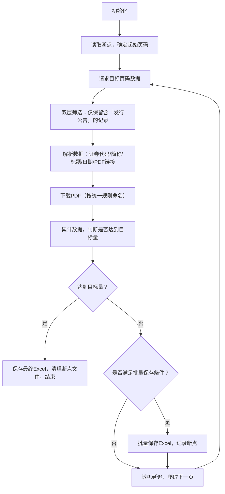

# 上交所债券发行公告爬虫

> 精准爬取上海证券交易所 2020-2024 年债券发行公告（含数据采集、PDF 下载、断点续爬），最终输出结构化 Excel 数据 + 对应 PDF 文件，总计爬取 7762 条有效数据。

---

## 📋 功能亮点

| 核心特性 | 具体说明 |
|----------|----------|
| 🎯 精准筛选 | 接口层 + 本地双层筛选，仅保留标题含「发行公告」的有效数据 |
| 🛡️ 鲁棒性强 | 内置请求重试、随机 UA、延迟策略，规避反爬机制 |
| �断点续爬 | 自动记录爬取进度，中断后可从上次页码继续，避免重复劳动 |
| 📦 批量保存 | 每 20 页自动保存 Excel，防止数据丢失 |
| 📄 文件名统一 | PDF 文件名 = 债券简称_公告标题，与 Excel 中记录完全对应 |
| 📊 进度可视化 | 实时打印爬取页数、新增条数、累计条数，进度一目了然 |

---

## 📁 输出结果

爬取完成后，生成以下文件/目录：
```text
E:\py\practice\
├── 上交所债券发行公告数据.xlsx  # 结构化数据（证券代码/简称/标题/日期/PDF名称）
├── pdf/                       # 下载的PDF文件（按「债券简称_公告标题」命名）
└── resume.txt                 # 断点文件（爬取中生成，完成后自动删除）
```

---

## ⚙️ 环境依赖

### 1. Python 版本
- Python 3.8+

### 2. 安装依赖
```bash
pip install requests pandas openpyxl urllib3
```

---

## 🚀 快速使用

### 1. 配置参数（核心）
修改代码中「核心配置」部分，适配你的需求：
```python
# ===================== 核心配置 =====================
SAVE_DIR = r"E:\py\practice\zpy"          # 数据保存根目录
PDF_SAVE_DIR = os.path.join(SAVE_DIR, "pdf")  # PDF保存子目录
MAX_PAGE = 311                             # 网页总页数（无需修改，适配目标数据量）
TARGET_DATA_COUNT = 7762                   # 目标爬取总条数（无需修改）
BATCH_SIZE = 20                            # 每20页批量保存一次
RETRY_TIMES = 3                            # 请求失败重试次数
MIN_DELAY = 1.5                            # 每页最小延迟（防反爬）
MAX_DELAY = 3                              # 每页最大延迟
RESUME_FILE = os.path.join(SAVE_DIR, "resume.txt")  # 断点文件路径
EXCEL_FILE = os.path.join(SAVE_DIR, "上交所债券发行公告数据.xlsx")  # Excel输出路径
```

### 2. 运行爬虫
```bash
python 爬虫脚本名.py
```

### 3. 中断与续爬
- **手动中断**：按 `Ctrl+C`，程序会自动保存已爬取数据，并记录断点；
- **断点续爬**：重新运行脚本，自动读取 `resume.txt`，从上次中断的页码继续爬取；
- **爬取完成**：自动删除 `resume.txt`，避免干扰下次爬取。

---

## 🧠 核心逻辑

### 1. 数据爬取流程


### 2. 关键优化点
- **请求会话优化**：使用 `requests.Session()` + `Retry` 策略，自动重试 429/500 等错误；
- **反爬策略**：随机 User-Agent、随机延迟（1.5-3秒）、Referer 伪装；
- **PDF 命名规则**：替换文件名特殊字符（`\/:*?"<>|`）为 `_`，避免文件创建失败；
- **异常处理**：覆盖请求失败、JSON解析失败、PDF下载失败等场景，程序不崩溃。

---

## ❗ 注意事项

1. **反爬提示**：请勿修改 `MIN_DELAY/MAX_DELAY` 为过小值，避免触发上交所反爬机制；
2. **路径问题**：`SAVE_DIR` 建议使用绝对路径，避免相对路径导致的文件保存失败；
3. **依赖兼容**：`openpyxl` 版本需 ≥ 3.0.0，否则可能导致 Excel 保存失败；
4. **网络环境**：确保网络通畅，爬取过程中断网会触发重试，重试失败则记录断点；
5. **文件权限**：确保 `SAVE_DIR` 有读写权限，避免无法创建目录/文件。

---

## 📊 爬取结果示例

### Excel 数据示例
| 证券代码 | 证券简称 | 公告标题 | 发布日期 | PDF名称 |
|----------|----------|----------|----------|---------|
| 123456 | XX公司债 | XX公司2024年债券发行公告 | 2024-01-01 | XX公司债_XX公司2024年债券发行公告 |

### PDF 文件示例
```text
pdf/XX公司债_XX公司2024年债券发行公告.pdf
```

---

## 🛠️ 问题排查

| 常见问题 | 解决方案 |
|----------|----------|
| PDF 下载失败 | 检查 PDF 链接是否有效，或网络是否能访问 `https://static.sse.com.cn` |
| Excel 保存失败 | 关闭已打开的 Excel 文件，或检查 `openpyxl` 是否安装成功 |
| 爬取数据为空 | 确认 `MAX_PAGE`/`TARGET_DATA_COUNT` 配置正确，或上交所接口未变更 |
| 断点文件不删除 | 爬取未完成，需继续运行至目标数据量，完成后自动删除 |
